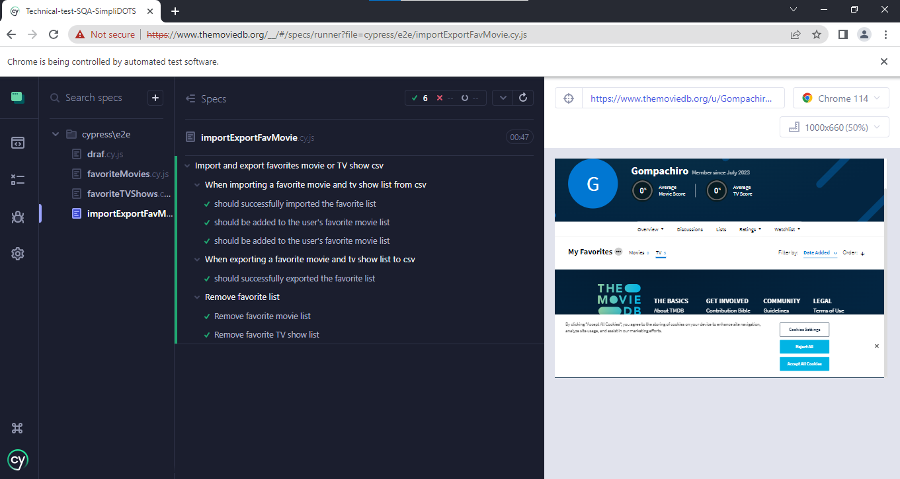

# Cypress Automation: Marks Movies or TV Shows as Favorite

This repository contains automated tests using Cypress for marks movies or TV shows as favorite on a The Movie Database (TMDb) website.

<B>» Links:</B>

- [Test Scenario](<test-scenario.md> "Test Scenario") 
- [Automation Result Validation](<optional-task/automationResultValidation.md> "Automation Result Validation") 
- [Suggestion](optional-task/suggestion.md> "Suggestion") 

<B>» Automation test record:</B>

##### Marks movie as favorite

##### Marks TV show as favorite

##### Import and export favorite list

<B>» Pre-requisites for this project include:</B>

- Node.js: v16.17.0
- Cypress: 12.16.0

<B>» Steps to use this project:</B>

1. Download or clone this repo
2. Install dependencies by running the following command in terminal (from inside your app directory i.e. where package.json is located): <I><B>npm install </I></B>
3. Open "cypress.env.json" and provide the username and password required for the test
4. Plase make sure there are no movie or tv show at your favorite list in your account 
5. Run test